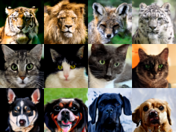

<div align=center>
  <h1>
  Denoising Diffusion Implicit Models (DDIM) <br> Classifier-Free Diffusion Guidance (CFG)
  </h1>
  <p>
    <a href=https://mhsung.github.io/kaist-cs492d-fall-2024/ target="_blank"><b>KAIST CS492(D): Diffusion Models and Their Applications (Fall 2024)</b></a><br>
    Programming Assignment 2
  </p>
</div> 

<div align=center>
  <p>
    Instructor: <a href=https://mhsung.github.io target="_blank"><b>Minhyuk Sung</b></a> (mhsung [at] kaist.ac.kr)<br>
    TA: <a href=https://dvelopery0115.github.io target="_blank"><b>Seungwoo Yoo</b></a>  (dreamy1534 [at] kaist.ac.kr)<br>
    Credit: <a href=https://63days.github.io target="_blank"><b>Juil Koo</b></a> (63days [at] kaist.ac.kr) & <a href=https://hieuristics.xyz target="_blank"><b>Nguyen Minh Hieu</b></a> (hieuristics [at] kaist.ac.kr)
  </p>
</div>

<div align=center>
   
</div>


## Abstract
In Assignment 1, we implemented the DDPM and explored how learning to remove noise from data can serve as a powerful framework for generative modeling. However, one immediate drawback of DDPM is its slow sampling process, typically requiring hundreds of denoising steps that can take several minutes, compared to existing techniques like VAEs and GANs. Another interesting direction we have not explored yet is conditional generation, since generative models become more useful when they offer sufficient control over the generation process. For instance, a user might want to generate images of a specific animal species after training the model on a dataset containing multiple animal classes. With that in mind, we will also explore the de facto standard technique for improving sample fidelity at the expense of sample diversity.

In this assignment, we will first explore Denoising Diffusion Implicit Models (DDIMs), a different class of diffusion models that dramatically reduces sampling time without requiring us to retrain our DDPMs from scratch. We will then turn to Classifier-Free Guidance (CFG), which can enhance the performance of diffusion models in conditional generation setups by modifying only a few lines of code.

## Setup

You may use the environment from Assignment 1. If you have not set up the environment yet, please follow the instructions below.

Create a `conda` environment named `ddpm` and install PyTorch:
```
conda create --name ddpm python=3.10
conda activate ddpm
conda install pytorch==1.12.1 torchvision==0.13.1 torchaudio==0.12.1 cudatoolkit=11.3 -c pytorch
```

Install the required package within the `requirements.txt`
```
pip install -r requirements.txt
```

**Please note that this assignment is heavily dependent on Assignment 1. To begin, you should copy the functions you implemented in [Assignment 1](https://github.com/KAIST-Visual-AI-Group/Diffusion-Assignment1-DDPM).** Specifically, make sure to complete the required components (e.g., the noise prediction network architecture and the forward/reverse DDPM steps) in the following files:
- `2d_plot_diffusion_todo/network.py`;
- `2d_plot_diffusion_todo/ddpm.py`;
- `image_diffusion_todo/model.py`;
- `image_diffusion_todo/scheduler.py`.

## Code Structure
```
.
├── 2d_plot_diffusion_todo    (Task 1)
│   ├── ddpm_tutorial.ipynb       <--- Main code
│   ├── dataset.py                <--- Define dataset (Swiss-roll, moon, gaussians, etc.)
│   ├── network.py                <--- A noise prediction network
│   └── ddpm.py                   <--- (TODO) Implement DDIM sampling
│
└── image_diffusion_todo (Task 2)
    ├── dataset.py                <--- Ready-to-use AFHQ dataset code
    ├── model.py                  <--- (TODO) Implement CFG sampling
    ├── module.py                 <--- Basic modules of a noise prediction network
    ├── network.py                <--- (TODO) Implement class conditioning mechanism and CFG training
    ├── sampling.py               <--- Image sampling code
    ├── train.py                  <--- DDPM/DDIM training code
    └── fid
        ├── measure_fid.py        <--- script measuring FID score
        └── afhq_inception.ckpt   <--- pre-trained classifier for FID
```


## Task 0: Introduction
### Assignment Tips

In this assignment, we will extend our previous assignment and implement two important techniques in diffusion models: Denoising Diffusion Implicit Models (DDIM) and Classifier-Free Diffusion Guidance (CFG).
As previously, implementing diffusion models is straightforward once you understand the theory behind them.
We thus highly recommend you to check out the details in the papers and understand the mathematics **BEFORE** you start the assignment.
The list of recommended resources is as follows:

1. [[Paper](https://arxiv.org/abs/2010.02502)] Denoising Diffusion Implicit Models (DDIM)
2. [[Paper](https://arxiv.org/abs/2207.12598)] Classifier-Free Diffusion Guidance (CFG)
3. [[Slides](./assets/summary_of_DDPM_and_DDIM.pdf)] Summary of DDPM and DDIM
4. [[Blog](https://sander.ai/2022/05/26/guidance.html)] "Guidance: a cheat code for diffusion models" by Sander Dieleman

## Task 1: Denoising Diffusion Implicit Models (DDIM)

By now, you might be familiar with the concept of DDPM, particularly how it generates samples by gradually removing noise from the data.

One downside of DDPM is the need to go through hundreds of denoising steps to fully denoise the data, which is computationally expensive, especially for high-dimensional data (e.g., high-resolution images). Surprisingly, the sampling process of DDPM can be accelerated with a simple mathematical tweak, **without the need to retrain the model from scratch.**

### Sampling

Recall that the algorithm for DDPM sampling is nothing but a sequence of noise predictions and denoising steps:

<p align="center">
  
</p>

To speed up sampling, we keep the pre-trained DDPM and only switch each step within the loop (line 4) to the following:

<p align="center">
  
</p>

Note that the symbol $\alpha_t$ in DDIM corresponds to $\bar{\alpha}_t$ in DDPM.
Please refer to [the paper](https://arxiv.org/abs/2010.02502), or our lecture slides for more details.

❗️❗️❗️ **You are only allowed to edit the part marked by TODO.** ❗️❗️❗️

### TODO

In this assignment, we will primarily reuse the code from the previous assignment. Before proceeding, please ensure that your previous results are successfully reproduced.

#### 1-1: Implement the DDIM Sampling Algorithm
Complete the definitions of the functions `ddim_p_sample()` and `ddim_p_sample_loop()` in `2d_plot_diffusion_todo/ddpm.py`.

#### 1-2: Testing with 2D Examples
Execute every cell in the notebook `2d_plot_diffusion_todo/ddpm_tutorial.ipynb`. All other parts of the notebook are the same as in the previous assignment, except that this time:
- the code will attempt DDIM sampling during training;
- the Chamfer Distance between the particles generated via the DDIM sampling and the ground truth will be reported.
For sanity checks, you may replace the invocation of `ddim_p_sample_loop` with `p_sample_loop`.

Take screenshots of:

1. the Chamfer Distance reported after executing the cell `DDIM Sampling`
2. the visualization of the sampled particles after executing the cell `DDIM Sampling`

Below is the example of (2).
<p align="center">
  
</p>

## Task 2: Classifier-Free Guidance (CFG)

We now turn to a more interesting problem. In many applications, generating data that matches user-specified conditions is more useful than generating arbitrary samples, such as text-guided image generation. In this task, we will explore the most representative technique for this purpose to date—the Classifier-Free Guidance (CFG).

Given a dataset consisting of pairs ($\mathbf{x}$, $\mathbf{c}$) of data $\mathbf{x}$ and its corresponding class label $\mathbf{c}$, CFG can be used to improve the quality of class-conditional samples by randomly omitting class labels during the training process. Specifically, a diffusion model is trained by following the procedure:

<p align="center">
  
</p>

After training the model, we can generate class-conditional samples by using a slightly modified version of the reverse diffusion process. The variable $w$, known as the guidance strength, enables us to balance the trade-off between sample quality and diversity:

<p align="center">
  
</p>

In this assignment, we will continue using the AFHQ dataset, consisting of animal images of three categories (cat, dog, wildlife), along with their class labels. We will train a DDPM model on the AFHQ dataset and generate class-conditional samples using CFG.

### TODO

#### 2-1: Implement Class Conditioning Mechanism

Implement a simple class conditioning mechanism in the method `forward` of the class `UNet` defined in the file `image_diffusion_todo/network.py`.
The optional argument `class_label` is assumed to be a PyTorch tensor holding the integer class labels.
Apply the one-hot encoding to the class labels. You may use the predefined linear layer `self.class_embedding`.
For now, the main backbone of the network is conditioned only on the diffusion timestep `temb`. How can we extend this further to support class conditioning?

**Use the script `image_diffusion_todo/train.py` with the flag `--use_cfg` to train the model with CFG enabled.**

> Before proceeding to the next steps, we highly recommend you to check whether class-conditioned training works properly.

#### 2-2: Implement CFG Training

Complete the `TODO` block in the method `forward` of the class `UNet` defined in the file `image_diffusion_todo/network.py`. It should be suffice to write a few lines of code that replace class labels with a zero tensor with probability `self.cfg_dropout` defined in class `UNet`.

#### 2-3: Implement CFG Sampling

Complete the `if do_classifier_free_guidance` blocks in the method `sample` in the file `image_diffusion_todo/model.py`. In our implementation, the CFG is enabled by setting `cfg_scale` greater than 0.0.

You can test your implementation by running the script `image_diffusion_todo/sampling.py`. Specifically, run
```
python image_diffusion_todo/sampling.py --ckpt_path @CKPT_PATH --save_dir @DIR_TO_SAVE_IMGS --use_cfg
```
by providing the path to your model's checkpoint trained *with* CFG training enabled.

#### 2-4: Test and Evaluate

As in our previous assignment, evaluate and report the FID measured on the samples generated using CFG with the scale of 0.0, and 7.5 (default).

Do NOT forget to execute `dataset.py` before measuring FID score. Otherwise, the output will be incorrect due to the discrepancy between the image resolutions.
```
python dataset.py # to constuct eval directory.
```

After processing the data, use the script `image_diffusion_todo/fid/measure_fid.py` to measure the FID score. The pre-trained inception model for FID is provided in the file `image_diffusion_todo/fid/afhq_inception.ckpt`.
```
python image_diffusion_todo/fid/measure_fid.py @GT_IMG_DIR @ GEN_IMG_DIR
```
Use the directory containing the processed data (e.g., `data/afhq/eval`) as @GT_IMG_DIR. The script will automatically search and load the images. The path @DIR_TO_SAVE_IMGS should be the same as the one you provided when running the script `sampling.py`.

## What to Submit

<details>
<summary><b>Submission Item List</b></summary>
</br>

- [ ] Code without model checkpoints
      
**Task 1**
- [ ] Chamfer distance result of DDIM sampling
- [ ] Visualization of DDIM sampling

**Task 2**
- [ ] FID computed using the samples generated using the CFG scale of:
  - 0.0  (no CFG)
  - 7.5  (default value in the script)
- [ ] 8 images generated using the CFG scale of:
  - 0.0  (no CFG)
  - 7.5  (default value in the script)
</details>

In a single PDF file, write your name and student ID, and include submission items listed above. Refer to more detailed instructions written in each task section about what to submit.
Name the document `{NAME}_{STUDENT_ID}.pdf` and submit **both your code and the document** as a **ZIP** file named `{NAME}_{STUDENT_ID}.zip`. 
**When creating your zip file**, exclude data (e.g., files in AFHQ dataset) and any model checkpoints, including the provided pre-trained classifier checkpoint when compressing the files.
Submit the zip file on GradeScope.

## Grading
**You will receive a zero score if:**
- **you do not submit,**
- **your code is not executable in the Python environment we provided, or**
- **you modify anycode outside of the section marked with `TODO` or use different hyperparameters that are supposed to be fixed as given.**

**Plagiarism in any form will also result in a zero score and will be reported to the university.**

**Your score will incur a 10% deduction for each missing item in the submission item list.**

Otherwise, you will receive up to 20 points from this assignment that count toward your final grade.

- Task 1
  - 10 points: Achieve CD lower than **60** from DDIM sampling.
  - 5 points: Achieve CD greater, or equal to **60** and less than **80** from DDIM sampling.
  - 0 point: otherwise.
- Task 2
  - 10 points: Achieve FID less than **30** in both CFG scales: 0.0 and 7.5.
  - 5 points: Achieve FID between **30** and **50** in one of the two CFG scales: 0.0 and 7.5.
  - 0 point: otherwise.

## Further Readings

If you are interested in this topic, we encourage you to check ou the materials below.

- [Denoising Diffusion Probabilistic Models](https://arxiv.org/abs/2006.11239) 
- [Denoising Diffusion Implicit Models](https://arxiv.org/abs/2010.02502) 
- [Diffusion Models Beat GANs on Image Synthesis](https://arxiv.org/abs/2105.05233) 
- [Score-Based Generative Modeling through Stochastic Differential Equations](https://arxiv.org/abs/2011.13456)
- [What are Diffusion Models?](https://lilianweng.github.io/posts/2021-07-11-diffusion-models/) 
- [Generative Modeling by Estimating Gradients of the Data Distribution](https://yang-song.net/blog/2021/score/) 
